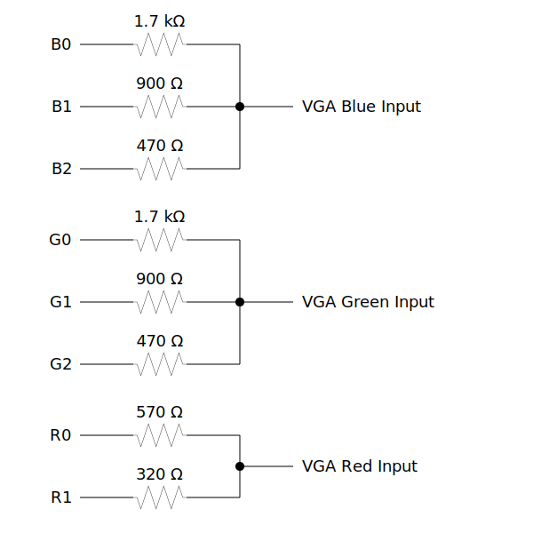

# STM32 MEDIA DRIVER TOOLKIT

This package provides a toolkit for developing applications with multimedia features using STM32 boards.
It implements a VGA driver, a basic primitive drawing library, a very basic audio driver and a basic USB input device driver.

This is an adaptation of an old project that I developed in 2014.

## VGA DRIVER

The driver generates a VGA signal with 256 colors RGB 2-3-3

A minimal DAC is needed to convert the 8 bit signal to the 3 channel VGA analog signals. This DAC can be easily built with only resistors.
The following picture describes how to build the DAC and how to connect it to the VGA adapter:



By default, the video output on the board uses the following pins:

- B0 -> PC8
- B1 -> PC9
- B2 -> PC10
- G0 -> PC11
- G1 -> PC12
- G2 -> PC13
- R0 -> PC14
- R1 -> PC15

But in the future this will be a configurable option.

If you don't want to build the DAC, it is still possible to generate the output without it, but the color combinations will be reduced to 8. Just pick 3 pins and place a 260 Ohm resistor between each one and the corresponding color pin on the VGA connector. You can also use a single pin if you want monochrome video. There's a wide option range!

## Example

Here is a basic example which demonstrates how to initialize the video driver.

```c

#include <stdio.h>

#include <stm32f4xx.h>
#include "mdt/graphics.h"
#include "mdt/text.h"


void example(void) {

    MDT_GRAPHICS_InitTypeDef graphicsCfg = {
        .useHardwareAcceleration = true,
        .useSDRAM = false,
        .mainCtxHeight = 200,
        .mainCtxWidth = 320,
        .videoDriver = VIDEO_DRIVER_VGA,
    };

    MDT_GRAPHICS_Init(&graphicsCfg);

    while (1) {

        MDT_Clear(0x00);
        
        MDT_DrawText("Hello world!", 10, 10, 0xFF);
        
        MDT_WaitForVSync();
        
        MDT_SwapBuffers();

    }

}

```

## Running the examples from scratch

1. Open STM32CubeIDE and create a new project: File > New > STM32 Project.

    - Click on `Board Selector` tab and select yours, then click next.

    - Give your project a name, use default options (`C`, `Executable`, `STM32Cube`) and click Finish.

    - When prompted to initialize all peripherals to default mode choose `No`.

      The `.ioc` configuration tool will open. If you go to `System view` only `DMA`, `GPIO`, `NVIC` and `RCC` should appear.

    - Go to `Categories > System Core > SYS` and set the `Debug` to `Serial Wire`.

    - Go to `Categories > System > RCC` and set the `High Speed Clock (HSE)` to `Crystal/Ceramic Resonator`.

    - Go to `Clock configuration` and choose whatever clock frequency combination you want, please note that for this project to work correctly the `HCLK` frequency should be a multiple of `25.175MHz`, otherwise you might experience issues.

    - Go to `Project Manager > Advanced Settings` and set the `GPIO` driver to `LL`.

1. If you want USB support:
  
    - Go to `Categories > Conectivity > USB_OTG_HS` and set the `Internal FS Phy` to `Host_Only`.

    - Go to `Categories > Middleware > USB_HOST` and set the `Class For HS IP` option to `Human Interface Host Class (HID)`, and in the platform Settings set the `Driver_VBUS_HS` to `GPIO:Output` and select your pin (PC4 in my case)

    - Go to `Categories > System > NVIC` and set `Prioriy Group` to `4 bits ...` and set the `USB On The Go HS Global Interrupt` priorities to the highest value.

    - Go to `Project Manager > Advanced Settings` and uncheck the `Generate Code` checkbox for `MX_USB_HOST_Init`

1. Open a terminal and navigate to the project `Middlewares` folder, once there `git clone` this repo.

1. Add the `include` and `examples/include` folders to the include directories.

1. Open the project with your OS Explorer and go to the `Drivers/STM32***_HAL_Driver` folder and copy the missing drivers.

    You should add your MCU's drivers, for example: for the STM32F4xx family you can find them [here](https://github.com/STMicroelectronics/stm32f4xx_hal_driver).

1. Edit `main.c` file and modify it according to this snippet:

```c

//...
/* USER CODE BEGIN Includes */
#include "mdt/examples/all.h"
/* USER CODE END Includes */
//...

void main(void) {

    //...
    /* USER CODE BEGIN 2 */
    MDT_EXAMPLE_term(); //or whatever example you want to run
    /* USER CODE END 2 */
    //...
    
}

```

## Notes

- Enabling any other peripherals could make the system unstable, please do it carefully.

- In `Project Properties > C/C++ Build > Settings > MCU GCC Compiler > Preprocessor`, the `USE_FULL_LL_DRIVER` definition should be set.

- In `NVIC` priority settings, lower value means higher priority.
